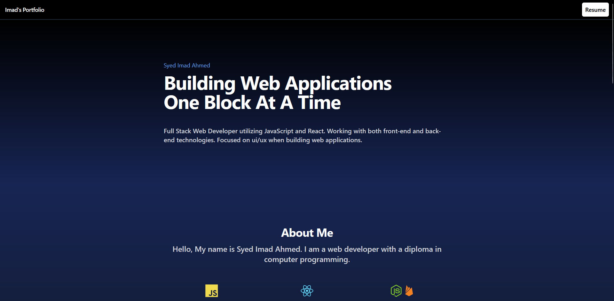

# My Portfolio

https://syedimadahmed.com

## Technology
- React
- Tailwind CSS

### To Do:
- Connect contact form
    - updated the .env codes and started updating the form code (but doesnt do anything when submitted?)
    - also need to make sure validation is functional (esp confirm email)
    - make sure submission works and redirects properly (hide existing form, maybe go to a new page?)
    
- Setup CI/CD (optional)
- Cleanup and format code
- Improve hero with a lottie that stops, or a dynamic responsive animation
- Decide flow of website (pages or subdomains (freelance, dev))
    - potential [Home], [Services - website management - website development - cloud development - technical support] or [Freelance], [Portfolio] or [Projects], [About], [Contact]
- Deploy